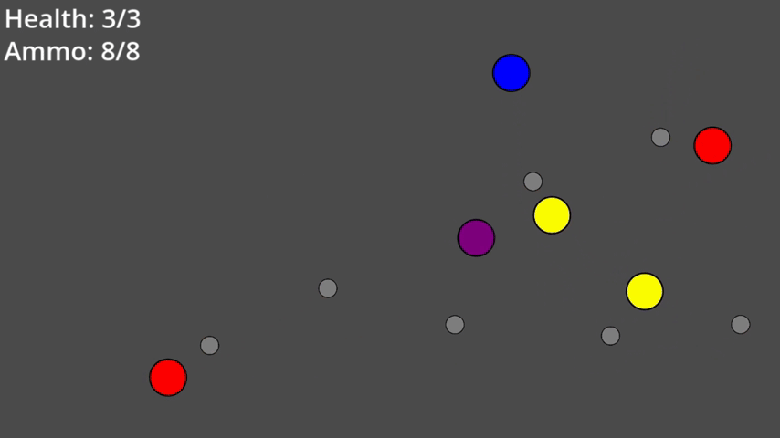

# Atticus's Adaptive Audio Activity (AAAA)
Check it out on itch.io: https://tticus.itch.io/adaptive-audio-activity

## Summary
A very small game where you play as a circle trying to survive an onslaught of other circles. The music changes in response to the game, and the game responds to the beat of the music.

## Features
* Made in Godot
* Adaptive music that responds to the state of the game world
* Game mechanics that respond to the beat of the music
* Simple M&K gameplay
* GUI for starting/restarting the game and viewing statistics about your performance at the end of each run

## Credits
Music created using BeepBox by John Nesky
* https://www.beepbox.co

Behavior Tree nodes based on lecture notes by Alexandre Tolstenko
* https://gameguild.gg/p/ai4games2/week-02

